# My GitLife

**A lightweight tool that converts public GitHub activity into aesthetic SVG cards suitable for GitHub READMEs.**

My GitLife turns a GitHub username into public-data analytics and a self-contained profile card. It is a TypeScript CLI with three stable card styles, three themes, deterministic SVG rendering, and no hosted service.

> My GitLife is not published to the npm registry yet. Use it from source or directly from this GitHub repository.

## Card examples

### Minimal — recommended for profile READMEs



### Story — detailed showcase



### Compact — balanced middle ground



These are real cards generated by the CLI from the public GitHub profile of `dRafaleD`.

## Quick start

From a clone of this repository:

```bash
npm ci
npm run cli -- dRafaleD --style minimal --theme github
```

This writes `gitlife.svg`. Add it to a README with:

```md

```

Run directly from GitHub without a global install:

```bash
npm exec --yes --package=github:dRafaleD/my-gitlife -- my-gitlife dRafaleD --style minimal
```

## Common commands

```bash
# Detailed editorial card (the compatibility-preserving default)
npm run cli -- dRafaleD --style story --theme midnight

# Denser profile card
npm run cli -- dRafaleD --style compact --theme github

# Restrained profile strip
npm run cli -- dRafaleD --style minimal --theme minimal

# Choose an output file
npm run cli -- dRafaleD --output gitlife.svg

# Print only SVG to stdout
npm run cli -- dRafaleD --stdout > gitlife.svg
```

Use `npm run cli -- --help` for the complete CLI reference. Output paths must be relative, remain inside the working directory, and end in `.svg`.

## Styles and themes

| Option | Values | Guidance |
| --- | --- | --- |
| `--style` | `story`, `compact`, `minimal` | `story` remains the default; `minimal` is recommended for most profile READMEs. |
| `--theme` | `midnight`, `github`, `minimal` | Two dark palettes and one light neutral palette. |

## What the card measures

- Only repositories that are public, non-forked, and owned by the requested account are analyzed.
- Language percentages aggregate bytes reported by GitHub's per-repository language endpoint; languages below the configurable meaningful threshold are omitted.
- If detailed language requests are incomplete, the SVG identifies partial or approximate fallback data.
- Activity reflects GitHub's recent available public events, not lifetime coding history.
- Stars, forks, followers, and repository totals are snapshots of public GitHub data at generation time.

## Privacy and safety

My GitLife requests public profile, owned public repository, public event, and repository-language endpoints only. Private, forked, or differently owned repositories are filtered before analytics and output.

`GITHUB_TOKEN` is optional and is used only as an Authorization header to increase GitHub API request limits. It is not written to the SVG or error messages. Avatar downloads are restricted to approved HTTPS GitHub hosts and safe raster formats; unsafe avatars fall back to initials.

No hosted backend is involved. Generation runs locally or in your own GitHub Actions workflow. See [automatic updates](./docs/AUTOMATIC_UPDATES.md) for a copy-ready scheduled workflow.

## Development

Requires Node.js 22.13 or newer.

```bash
npm ci
npm run typecheck
npm test
npm run build
npm audit
```

See [CONTRIBUTING.md](./CONTRIBUTING.md) for the contribution workflow and [SECURITY.md](./SECURITY.md) for vulnerability reporting.

## License

[MIT](./LICENSE)
